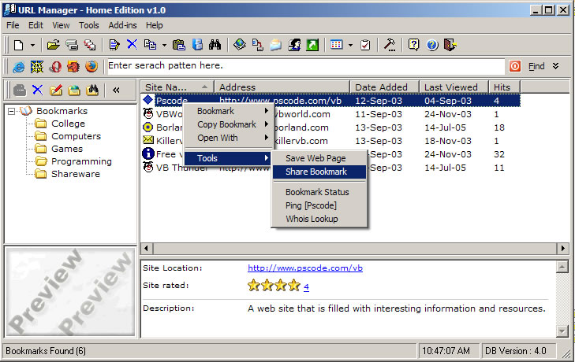



## URL Manager \- Home Edition v1\.0

### Description

This is a full bookmarks program for storeing all your fav websites, this was ment to be a shareware app then turned to freeware. but never realsed it. so I now started a band new version. so I thought I submit the old one. so here it is.

DM URL Bookmarker is a powerful freeware bookmark URL Organizer program for windows that will to allow you store all your favorite web links.This program offers various special features on how your bookmarks are stored and organized. Most common features include organizing bookmarks in different Categories, Checking bookmark URL status. ,

Other features include exporting bookmarks, Backup and restoring bookmarks, an easy to use config interface that allows you to config the program to your liken. Importing existing databases and much more. This program also offers a powerful set of tools that will allow you to share bookmarks with friends, performing a whois lookup on the bookmark domain name.

At present this program supports all the major web browsers.

Please vote if you like this code.
 
### More Info
 

             |
---                |---
**Submitted On**   |2005-07-14 10:45:08
**By**             |[dreamvb](https://github.com/Planet-Source-Code/PSCIndex/blob/master/ByAuthor/dreamvb.md)
**Level**          |Advanced
**User Rating**    |4.9 (68 globes from 14 users)
**Compatibility**  |VB 6\.0
**Category**       |[Complete Applications](https://github.com/Planet-Source-Code/PSCIndex/blob/master/ByCategory/complete-applications__1-27.md)
**World**          |[Visual Basic](https://github.com/Planet-Source-Code/PSCIndex/blob/master/ByWorld/visual-basic.md)
**Archive File**   |[URL\_Manage1913357142005\.zip](https://github.com/Planet-Source-Code/dreamvb-url-manager-home-edition-v1-0__1-61700/archive/master.zip)

